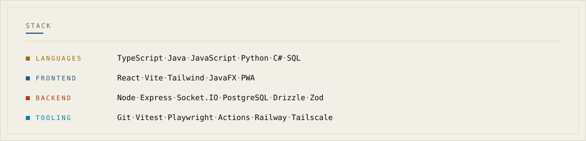
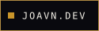

<a href="https://joavn.dev">
  <picture>
    <source media="(max-width: 600px) and (prefers-color-scheme: dark)" srcset="assets/banner-narrow-dark.svg">
    <source media="(max-width: 600px)" srcset="assets/banner-narrow-light.svg">
    <source media="(prefers-color-scheme: dark)" srcset="assets/banner-dark.svg">
    
  </picture>
</a>

I build primarily for the web, with a focus on full-stack development and
thoughtful UI/UX.

I challenge myself with genuine personal projects that I'm passionate about.
I build things that I'd actually want to use myself.

<picture>
  <source media="(max-width: 600px) and (prefers-color-scheme: dark)" srcset="assets/stack-narrow-dark.svg">
  <source media="(max-width: 600px)" srcset="assets/stack-narrow-light.svg">
  <source media="(prefers-color-scheme: dark)" srcset="assets/stack-dark.svg">
  
</picture>

<picture>
  <source media="(max-width: 600px) and (prefers-color-scheme: dark)" srcset="assets/scoreboard-narrow-dark.svg">
  <source media="(max-width: 600px)" srcset="assets/scoreboard-narrow-light.svg">
  <source media="(prefers-color-scheme: dark)" srcset="assets/scoreboard-dark.svg">
  
</picture>

<picture>
  <source media="(max-width: 600px) and (prefers-color-scheme: dark)" srcset="assets/langs-narrow-dark.svg">
  <source media="(max-width: 600px)" srcset="assets/langs-narrow-light.svg">
  <source media="(prefers-color-scheme: dark)" srcset="assets/langs-dark.svg">
  
</picture>

  

&nbsp;

&nbsp;

